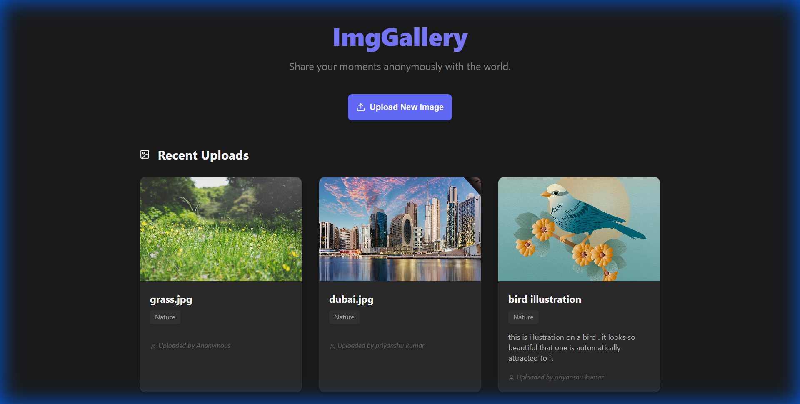

# ImgGallery

A modern, responsive image gallery web application built with React and Supabase. This application allows users to browse a collection of images, upload their own, and download high-quality versions.



## 🚀 Features

-   **Image Gallery**: Browse a visually appealing grid of high-quality images.
-   **Image Upload**: Seamlessly upload new images to the cloud storage.
-   **Detailed View & Download**: Click on any image to view it in detail and access the download option.
-   **Responsive Design**: Optimized for a great experience on both desktop and mobile devices.
-   **Navigation**: Easy navigation between the gallery and upload pages.

## 🛠️ Tech Stack

This project leverages a modern frontend stack for performance and developer experience:

-   **Frontend**: [React 19](https://react.dev/) - A JavaScript library for building user interfaces.
-   **Build System**: [Vite](https://vitejs.dev/) - Next Generation Frontend Tooling.
-   **Routing**: [React Router v7](https://reactrouter.com/) - Client-side routing for seamless navigation.
-   **Backend & Storage**: [Supabase](https://supabase.com/) - The open source Firebase alternative (PostgreSQL + Storage).
-   **Icons**: [Lucide React](https://lucide.dev/) - Beautiful, consistent icons.
-   **Styling**: Vanilla CSS - Custom, lightweight styling without external CSS frameworks.
-   **Linting**: [ESLint](https://eslint.org/) - Pluggable linting utility for JavaScript and JSX.

## 📦 Getting Started

Follow these steps to set up the project locally.

### Prerequisites

-   Node.js (Latest LTS recommended)
-   npm (comes with Node.js)

### Installation

1.  **Clone the repository**

    ```bash
    git clone <repository-url>
    cd imggallery
    ```

2.  **Install dependencies**

    ```bash
    npm install
    ```

3.  **Run the development server**

    ```bash
    npm run dev
    ```

4.  **Open in Browser**

    Open your browser and navigate to `http://localhost:5174` to view the application.

## 📂 Project Structure

-   `src/`: Application source code
    -   `components/`: Reusable UI components
    -   `App.jsx`: Main application component
    -   `supabaseClient.js`: Supabase configuration
-   `public/`: Static assets
-   `index.html`: Entry HTML file

## 🤝 Contributing

Contributions are welcome! Please feel free to submit a Pull Request.
